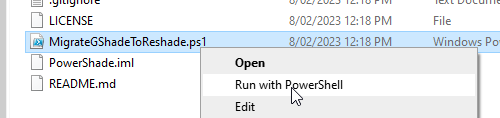

# PowerShade
PowerShell script to automatically migrate GShade installations to ReShade. For Final Fantasy XIV on Windows only.

Based on this tutorial by rika: https://gist.github.com/ry00001/3e2e63b986cb0c673645ea42ffafcc26

This tool will not work if you've already uninstalled GShade (for now!).

## How to download

https://raw.githubusercontent.com/Tactitocalon/PowerShade/master/MigrateGShadeToReshade.ps1

Click this link, right-click and select the `Save Page As` option to save the PowerShell script to your computer.

## Usage instructions

This is intended to be used if you have an existing GShade installation, and you want to
migrate to ReShade. Download `MigrateGShadeToReshade.ps1` from this repository and run the script by 
right-clicking it and selecting `Run with PowerShell`.

The script will verify your installation, and after asking for your permission to update (a rather 
extraordinary courtesy, I know!), it will backup existing GShade shaders, presets and configuration, 
download ReShade (and patched shaders), install ReShade and do its best to migrate your configuration.

Note: This tool does not completely uninstall GShade. For that, try this tool: https://github.com/MirisWisdom/GShade.Nuke
